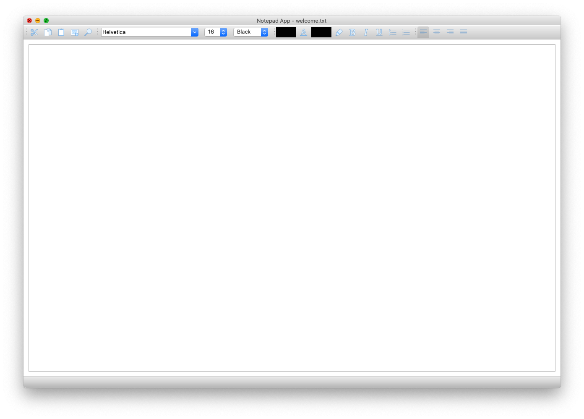
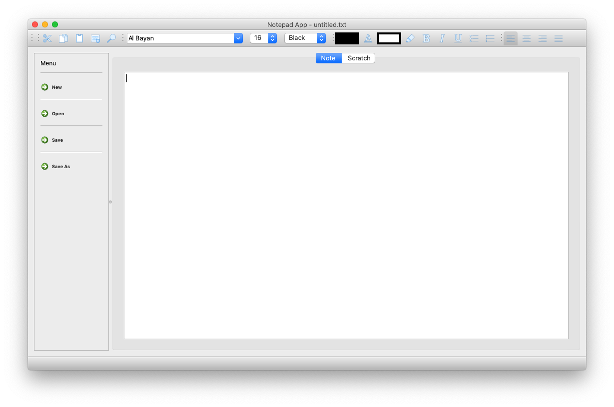

# Note Taking App

## Overview
An everyday note taking app that supports user profiles and ecrypts all data (files and login information).
Rich text formatting supported to help you take the best, most effective, notes possible. Two interfaces are offered to best suite all work flows and to encourage user productivity.

Happy note taking!

### Group name: smells-like-team-spirit
- [CS-340 Course website](http://web.eecs.utk.edu/courses/fall2020/cosc340/)


## About
This app offers two different note taking interfaces that both include the same great features, only with different note taking styles in mind. In _[main.py](main.py)_, users can focus on one note at a time and have an open canvas, eliminating distractions in the note taking process. For users that prefer a multitasking environment, we offer _[app.py](app.py)_, a similar experience that adds the ability to have a second note tab to write down quick thoughts. The window also has a pane dedicated to switching between notes (new, open, save, save as) to allow one workspace to quickly be converted into another by picking up where you left off on a different note.


## Preview
From the _smells-like-team-spirit_ directory, run _[main.py](main.py)_:

    $ python main.py
    



Or run  _[app.py](app.py)_:

    $ python app.py



Toolbar icons sourced from the Blue UI set at [icons8.com](https://icons8.com/).


## Dependencies 
All dependencies for this project are listed in _[requirements.txt](requirements.txt)_:

```
$ cat requirements.txt
cryptography
PyQt5
bcrypt
certifi
```

To automatically install these dependencies, run the following commands in the _smells-like-team-spirit_ directory:

```
$ pip install -r requirements.txt
```


## Authors
[Noah Burgin](https://github.com/UTK-CS340-Fall-2020/smells-like-team-spirit/issues?q=assignee%3Anoah-22+is%3Aopen),
[Dylan Lomax](https://github.com/UTK-CS340-Fall-2020/smells-like-team-spirit/issues?q=is%3Aopen+assignee%3AMaze-Mind),
[Nick Creech](https://github.com/UTK-CS340-Fall-2020/smells-like-team-spirit/issues?q=is%3Aopen+assignee%3Ancreech1),
[Zach Creech](https://github.com/UTK-CS340-Fall-2020/smells-like-team-spirit/issues?q=is%3Aopen+assignee%3Azach7creech)
